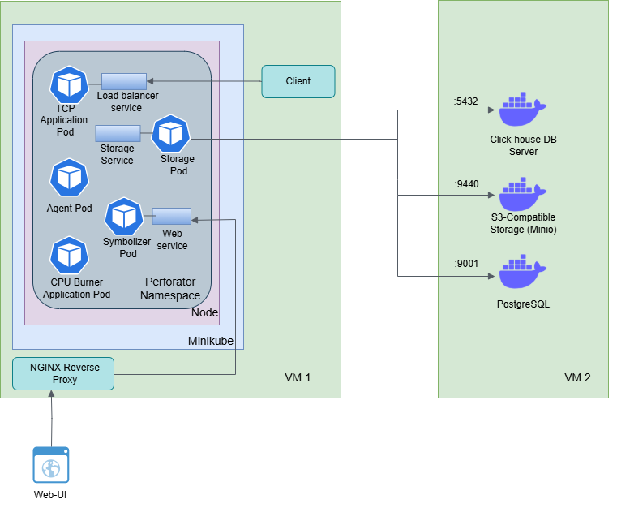

# Steps to deploy perforator inside kubernetes cluster


## Our Experiment Setup 




 As shown in figure,  the first VM hosted the Perforator cluster, which included all core components and services. We used Minikube to set up the cluster, deploying it within an isolated Kubernetes namespace named perforator. The second VM was dedicated to database services required by Perforator. It ran ClickHouse, PostgreSQL, and MinIO (an S3-compatible object storage service) as Docker containers. We then configured the Perforator cluster to connect to these external database endpoints.


## Database Services Setup on VM 2

1. Clone the perforator git repository 


     ```bash
        git https://github.com/yandex/perforator.git
     ```

2. Setup postgressql, clickhouse and minio (S3-compatible storage) 
	
    ```bash
	cd perforator/deploy/db/docker-compose/
    docker compose up -d
    ```

3. Generate an access key and secret key for MinIO to enable access.

    3.1 Install minio client 
    
    ```bash
        wget https://dl.min.io/client/mc/release/linux-amd64/mc 
        chmod +x mc 
        sudo mv mc /usr/local/bin/
    ``` 

    3.2 Create minio admin alias using following command

    ```bash
        mc alias set myminio https://localhost:9001 perforator perforator --insecure 
    ```

    3.3 Create policy.json file to define privilege for access and secret key. Below policy is for full access previlage for keys. 
    ```bash
        {
        "Version": "2012-10-17",
        "Statement": [{
            "Effect": "Allow",
            "Action": ["s3:*"],
            "Resource": ["arn:aws:s3:::*"]
        }]
        }
    ```

    3.4 Create access and secret key using following command. After running this command, you can see access and secret key on terminal. 

    ```bash
    mc admin accesskey create myminio/ perforator  --access-key perforatoraccesskey --secret-key perforatorsecretkey     --policy policy.json --insecure
    ```

## Setup perforator on VM 1

1. Install helm and minikube on this VM


2. Add the Perforator Helm Repository

    ```bash
        helm repo add perforator https://helm.perforator.tech
	    helm repo update
    ```

3. Start minikube with enough resources.

    ```bash
     minikube start --cpus=4 --memory=8192 --disk-size=40g
    ```
4. Create namespace perforator

    ```bash
    kubectl create namespace perforator
    ```
5. Create my_values.yaml file 

```bash
databases:
  postgresql:
    migrations:
      enabled: true
    endpoints:
      - host: "<VM2 IP>"
        port: 5432
    db: "perforator"
    user: "perforator"
    password: "perforator"
  clickhouse:
    migrations:
      enabled: true
    replicas:
      - "<VM2 IP>:9440"
    db: "perforator"
    user: "perforator"
    password: "perforator"
    insecure: true
  s3:
    buckets:
      # If buckets were created with recommended names
      profiles: "perforator-profile"
      binaries: "perforator-binary"
      taskResults: "perforator-task-results"
      binariesGSYM: "perforator-binary-gsym"
    endpoint: "<VM2 IP>:9001"
    accessKey: "<Minio Access Key>"
    secretKey: "<Minio Secret Key>"
    insecure: true
    force_path_style: true
proxy:
  url_prefix: http://<Pulic IP of VM 1>:<NGINX Listen PORT>/static/results/
```

6.  Install the Perforator Helm Chart

    ```bash
        helm install perforator-release -n perforator perforator/perforator -f my-values.yaml
    ```

7.  Access the Perforator Web UI Locally
    ```bash
    kubectl port-forward svc/perforator-release-web-service -n perforator 8080:80
    ```

8. To make the Perfrator web service accessible to the external world, we use an Nginx server as a reverse proxy. It listens on port 8081 and forwards incoming requests to the service running on port 8080. 

   ```bash 
   upstream backend {
        server 127.0.0.1:8080;
    }

     server {
        listen 8081;
        location / {
            #rewrite ^/api/(.*)$ /$1 break;
            proxy_pass http://backend;
            proxy_http_version 1.1;
            proxy_set_header Host $host;
            proxy_set_header X-Real-IP $remote_addr;
            proxy_set_header X-Forwarded-For $proxy_add_x_forwarded_for;
            proxy_set_header Connection "";

            proxy_buffering off;  # Disable response buffering
     }
    }
    ```

9. Open a browser and navigate to http://<Public IP of VM 1>:8081/. You will see the Perfrator UI. Using the selector within the interface, you can view the profiles of any pod or service in the cluster.s